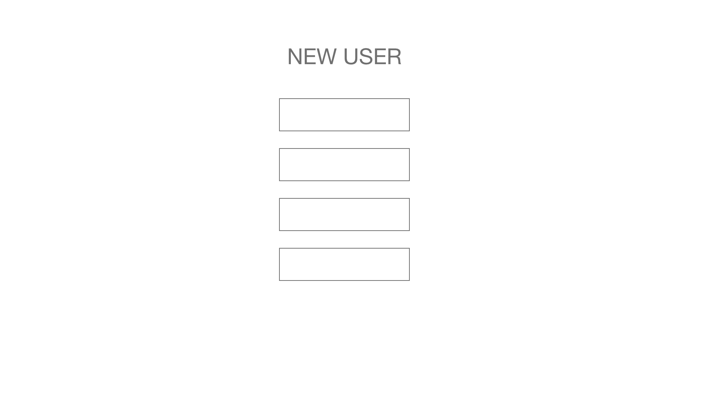
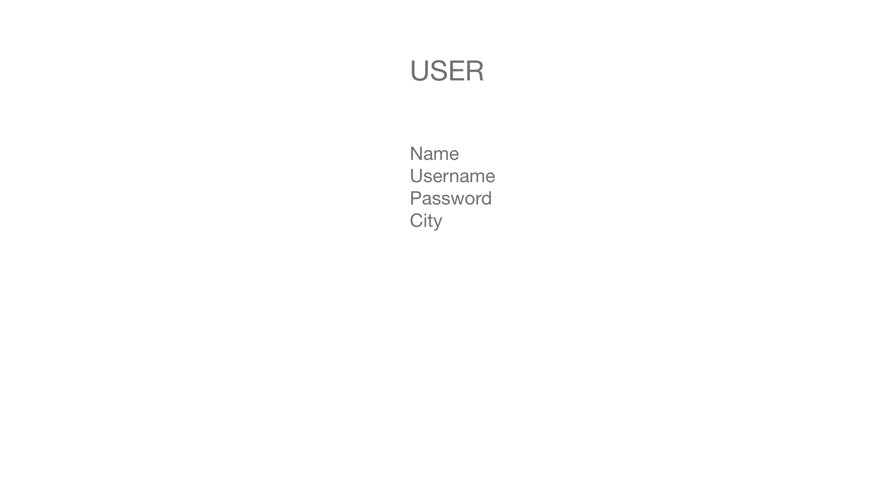
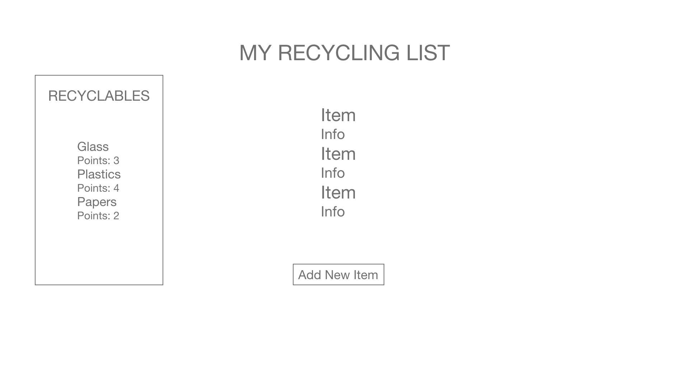
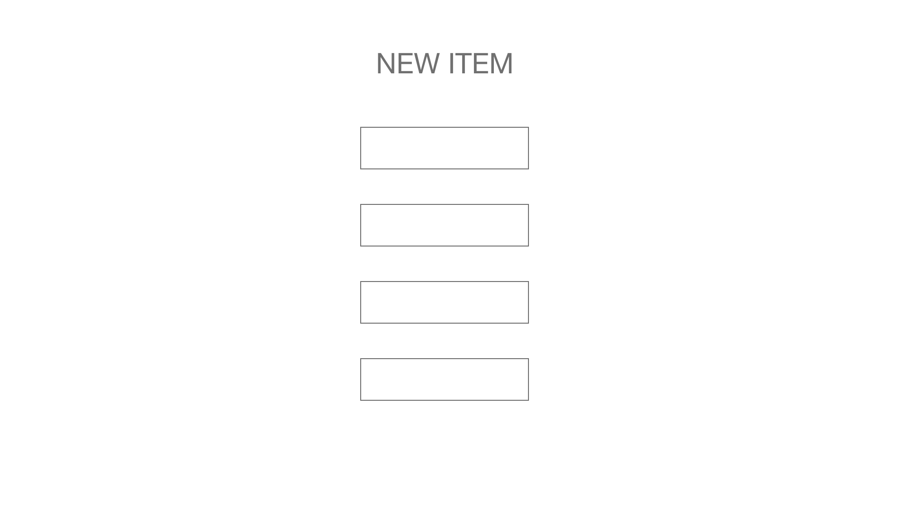
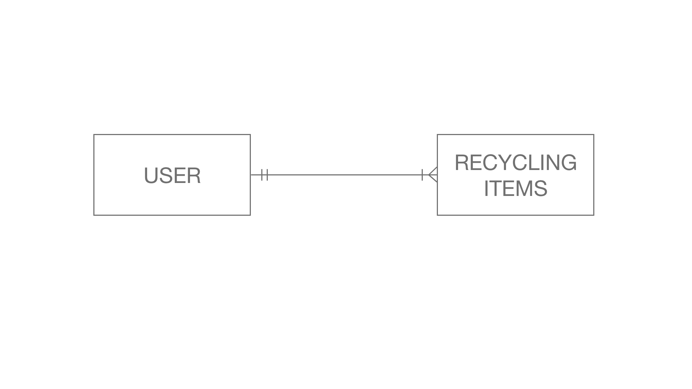

# SEI22 Project 3: recycleThat

* To Do: develop a full MERN stack application integrating databases and working with MVC architechture

* Languages: HTML, CSS, JavaScript

* Stack: Mongo, Express, React, Node

* Libraries: Ant Design

[GitHub](https://github.com/racheltezza/project3-recycling "My gitHub repo")

[Project](https://tranquil-coast-91943.herokuapp.com/ "My deployed site")

[Trello](https://trello.com/b/NFh8pEY0/sei22-project-3 "My Trello board")

#### Wireframes
   

#### ERD

### Future Goals

* Integrate recycling center finder API
* User login authentication
* Re-usable recycling items from user's list history

